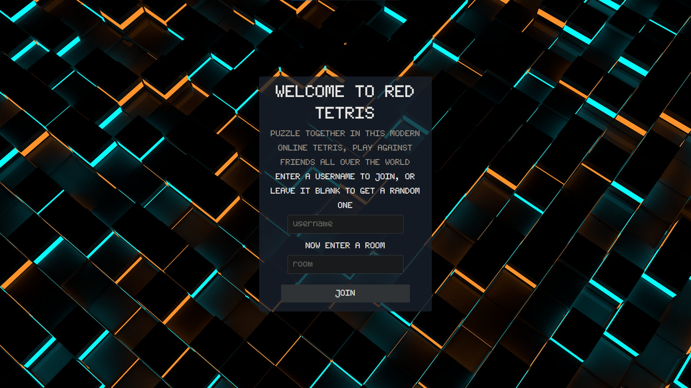
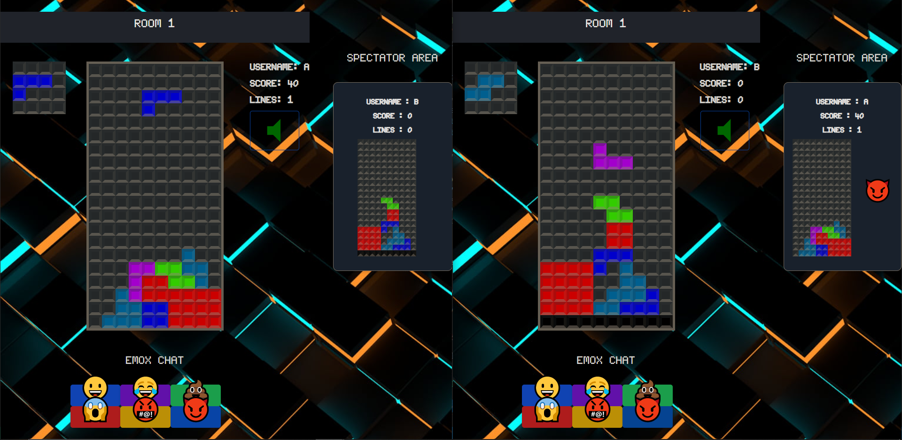

# Red-Tetris

A multiplayer tetris game.
Front-end is made using `react` and `redux`.
Back-end is made using `NodeJS`.
Client-Server communication is made with `socket.io`.
Unit Tests are made with `Jest`.

## Getting Started

In the src directory, you can run to start the client:

### `npm start`

In the server directory, you can run to start the server:

### `npm start`

Then Open [http://localhost:3000](http://localhost:3000) to view it in your browser.

## Unit Test Coverage

To check the unit tests coverage we can run:

### `npm run coverage`

## Screenshots

Home Page:

Multiplayer Game Page:

